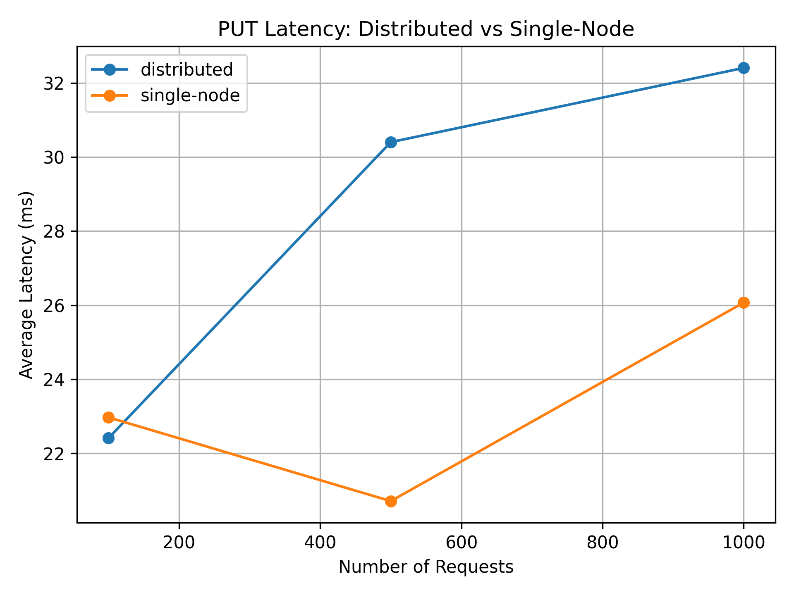
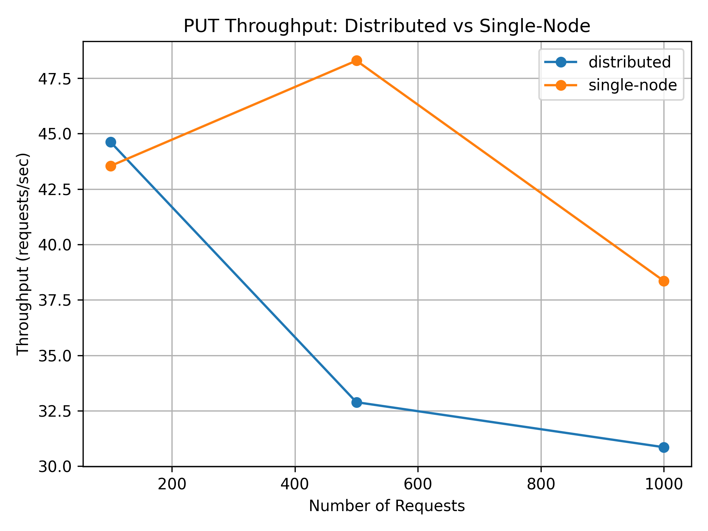
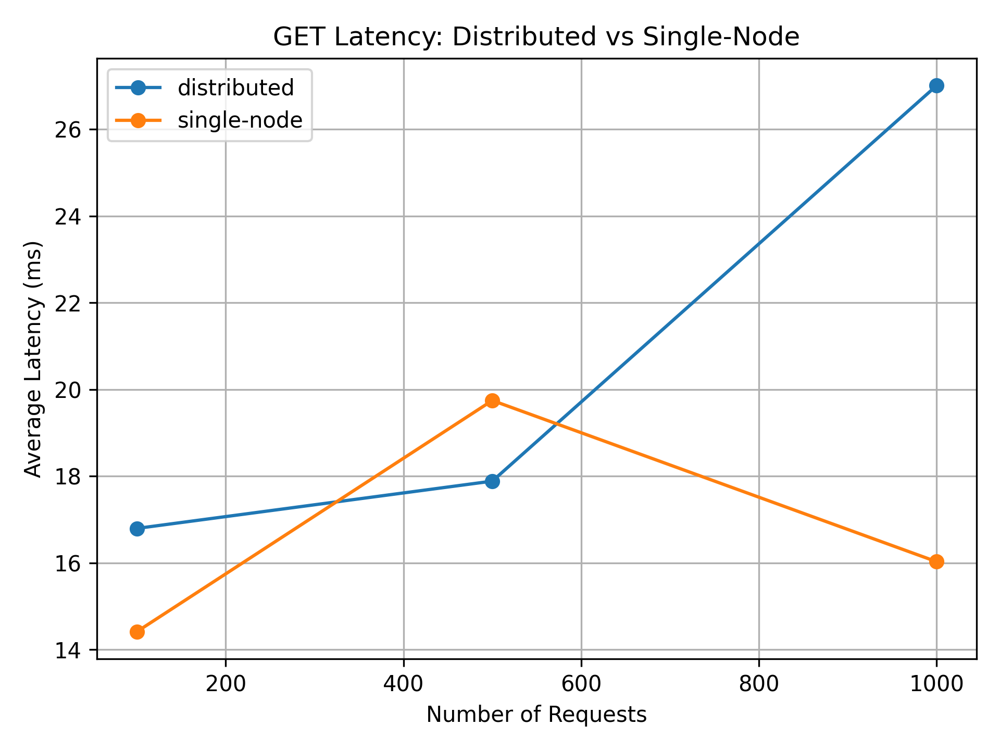
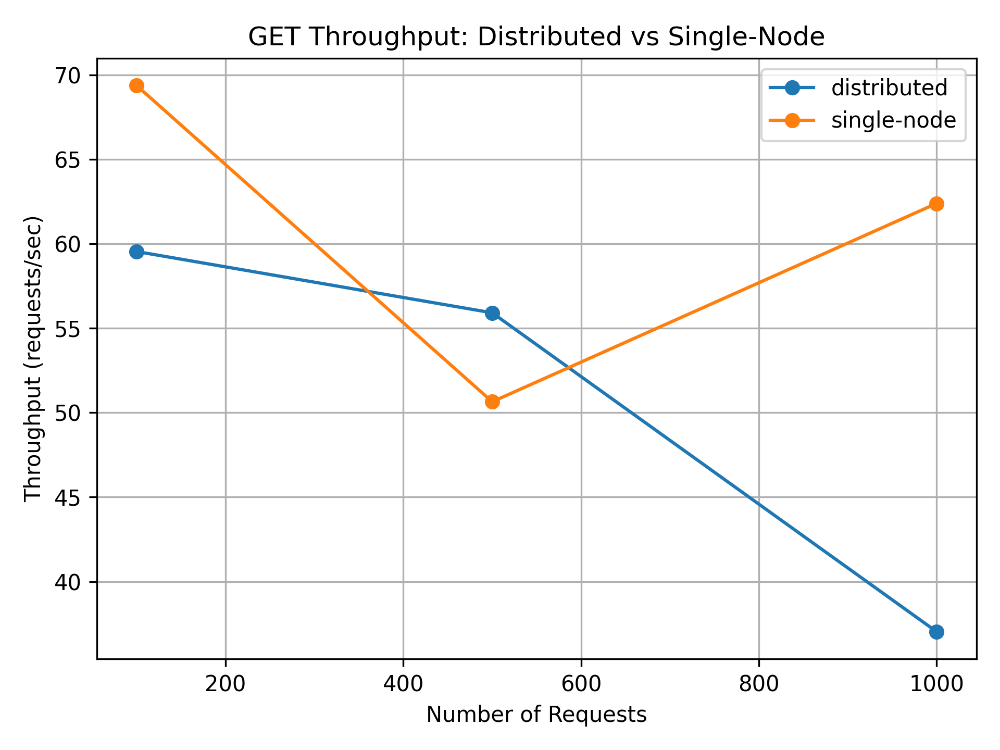

# CloudScale

## Fault-Tolerant Distributed Object Storage System

CloudScale is a distributed object-storage system implemented in **Go** to study the practical trade-offs between **replication, consensus, fault tolerance, consistency, and performance**.

The project evolves from a single-node storage engine into a multi-node system using **Raft consensus, replicated state, leader election, failure detection, automatic recovery, authenticated API access, Docker, Kubernetes, observability, chaos experiments, cloud deployment, and performance evaluation**.

---

## Research Question

> **How does Raft-based replication and consistency enforcement affect the performance of a distributed object storage system as workload size increases?**

CloudScale combines systems engineering with experimental evaluation. The goal is not only to build a distributed storage service, but also to measure the performance and recovery costs introduced by distributed coordination.

---

## Key Results

Repeated 1,000-request experiments comparing a single-node configuration with a three-node Raft cluster produced:

| Metric | Single Node | 3-Node Raft | Change |
|---|---:|---:|---:|
| PUT throughput | 36.93 req/s | 16.00 req/s | -56.68% |
| PUT latency | 27.35 ms | 62.55 ms | +128.68% |
| GET throughput | 48.88 req/s | 46.47 req/s | -4.92% |
| GET latency | 20.53 ms | 21.84 ms | +6.36% |

Additional fault-tolerance experiments measured:

- **Leader recovery time:** 13.432 seconds
- Successful leader election after leader failure
- Successful writes after leader failure
- Successful reads after recovery
- Replica synchronization after a failed node rejoined
- Replica convergence to the same committed log state

### Main Finding

**Distributed writes incur significant coordination overhead, while read performance remained comparatively close to the single-node baseline under the tested workload.**

This demonstrates a fundamental distributed-systems trade-off:

```text
More coordination
       |
       v
Higher write overhead
       |
       +
       |
       v
Replicated state + fault tolerance
```

---

## Architecture

```text
                              Client
                                |
                                v
                       +----------------+
                       |  API Gateway   |
                       +----------------+
                                |
                     Authentication / Routing
                                |
                    +-----------+-----------+
                    |           |           |
                    v           v           v
               +---------+ +---------+ +---------+
               | Node 1  | | Node 2  | | Node 3  |
               | Leader  | |Follower | |Follower |
               +---------+ +---------+ +---------+
                    |           |           |
                    +-----------+-----------+
                                |
                         Raft Replicated Log
                                |
                         Commit / Apply
                                |
                    +-----------+-----------+
                    |                       |
                    v                       v
              Persistent State       Object Storage
```

---

## Write Path

```text
Client
  |
  v
API Gateway
  |
  v
Raft Leader
  |
  +----> Replicate log entry
  |              |
  |              +----> Follower
  |              |
  |              +----> Follower
  |
  v
Commit
  |
  v
Apply to storage
  |
  v
Response
```

---

## Failure Path

```text
Leader Failure
      |
      v
Heartbeat timeout
      |
      v
Leader election
      |
      v
New leader
      |
      v
Writes continue
      |
      v
Failed node rejoins
      |
      v
Replica synchronization
      |
      v
Cluster convergence
```

---

## Core Components

| Component | Responsibility |
|---|---|
| Storage Engine | Object persistence and retrieval |
| Distributed Nodes | Independent storage processes |
| Replication | Replicated state across nodes |
| Raft | Consensus and replicated log |
| Failure Detection | Heartbeats and failure detection |
| Fault Tolerance | Leader failover and recovery |
| API Gateway | External request routing |
| Authentication | Protected API access |
| Scheduler | AI-oriented workload scheduling |
| Docker | Containerized deployment |
| Kubernetes | Cluster orchestration |
| Prometheus | Metrics collection |
| Grafana | Monitoring dashboards |
| AWS / EKS | Cloud deployment experiments |
| Benchmarking | Performance measurement |
| Research Analysis | Experimental interpretation |

---

## Raft Consensus

CloudScale uses Raft to coordinate replicated cluster state.

The implementation tracks core consensus state including:

- Current term
- Voted-for node
- Raft log
- Commit index
- Last applied index
- Node state
- Leader identity
- Replication progress

The cluster size is derived from the configured peer set, allowing the same implementation to operate in both single-node and multi-node configurations.

A replicated write follows this process:

1. Client sends a request to the gateway.
2. Gateway identifies the active leader.
3. Leader appends the operation to its Raft log.
4. The log entry is replicated to followers.
5. The entry reaches the required commit condition.
6. The committed operation is applied to storage.
7. The result is returned to the client.

---

## Replication

CloudScale maintains replicated state across multiple nodes.

For a three-node cluster:

```text
               +---------+
               | Leader  |
               +---------+
                /       \
               /         \
              v           v
       +---------+   +---------+
       | Node 2  |   | Node 3  |
       |Follower |   |Follower |
       +---------+   +---------+
```

Replication provides redundancy and allows the cluster to continue operating when a leader fails, provided enough nodes remain available for the implemented recovery path.

---

## Fault Tolerance

CloudScale was explicitly tested under leader-failure conditions.

### Failure experiment

1. Start a three-node cluster.
2. Establish a leader.
3. Stop the active leader.
4. Allow the remaining nodes to detect the failure.
5. Observe leader election.
6. Send a new write through the gateway.
7. Verify data availability.
8. Restart the failed node.
9. Allow replica synchronization.
10. Verify cluster convergence.

### Result

**Leader recovery time: 13.432 seconds**

The experiment successfully demonstrated:

- Failure detection
- Leader election
- Continued write availability
- Data availability
- Replica recovery
- Cluster convergence

---

## Consistency

CloudScale uses a **leader-oriented consistency model** for API operations.

- Gateway reads are routed to the current Raft leader.
- Direct follower reads can return a non-leader response rather than serving independently from a follower.
- State-changing operations are coordinated through the Raft replicated log.

The implementation should therefore be understood as a research prototype with leader-oriented reads and Raft-coordinated replicated writes, rather than as a claim of full production-grade consistency semantics.

---

## API Gateway

The API gateway provides the external entry point to the distributed system.

| Endpoint | Purpose |
|---|---|
| `GET /health` | Gateway and cluster health information |
| `GET /raft/status` | Raft state, term, commit index, leader and replication information |
| Protected API operations | Authenticated object-storage operations |

### Default Ports

| Component | Port |
|---|---:|
| Gateway | 9000 |
| Node 1 | 8001 |
| Node 2 | 8002 |
| Node 3 | 8003 |

### Raft Status

The `/raft/status` endpoint exposes information such as:

- Current term
- Raft state
- Voted-for node
- Commit index
- Last applied index
- Last log index
- Leader information
- Replication progress

---

## Security

CloudScale includes security-related infrastructure including:

- Authentication
- Authorization
- Protected API operations
- Audit logging
- Encryption-related functionality

Secrets and runtime credentials are intentionally excluded from the repository through `.gitignore`.

For production deployment, additional security hardening would still be required.

---

## Performance Evaluation

CloudScale includes a reproducible benchmark workflow comparing:

**Single-node storage vs. Three-node Raft cluster**

The benchmark evaluates:

- PUT latency
- PUT throughput
- GET latency
- GET throughput
- Distributed coordination overhead
- Resource utilization
- Failure recovery

The repeated benchmark dataset uses **three runs of a 1,000-request workload** for each configuration and operation.

---

## Benchmark Results

### PUT Latency



### PUT Throughput



### GET Latency



### GET Throughput



Detailed experimental results are available in:

- `benchmarks/results/phase16_results.md`
- `benchmarks/results/phase17_analysis.md`
- `benchmarks/results/phase17_repeated_results.md`

Raw benchmark data is stored under:

- `benchmarks/data/`

---

## Experimental Findings

### PUT Operations

Mean single-node PUT latency:

**27.353 ms**

Mean distributed PUT latency:

**62.549 ms**

The distributed configuration therefore experienced approximately:

**+128.68% latency**

Mean PUT throughput changed from:

**36.933 req/s → 16.000 req/s**

or approximately:

**-56.68%**

This reflects the cost of replicated coordination.

### GET Operations

Mean single-node GET latency:

**20.533 ms**

Mean distributed GET latency:

**21.838 ms**

The difference was approximately:

**+6.36%**

GET throughput changed from:

**48.877 req/s → 46.470 req/s**

or approximately:

**-4.92%**

Under the tested workload, reads experienced substantially less overhead than writes.

---

## Replica Convergence

During recovery testing, all three replicas converged to the same committed state.

Observed final indices:

```text
commit_index = 1603
last_log_index = 1603
last_applied = 1603
```

Matching indices across replicas provide evidence that the cluster successfully synchronized its committed state after recovery.

---

## Observability

CloudScale integrates with:

- **Prometheus** for metrics collection
- **Grafana** for visualization
- Health endpoints
- Raft status endpoints

Monitoring manifests are included in:

`deployments/`

The observability phase makes cluster behavior and runtime performance easier to inspect during experiments.

---

## Docker

CloudScale supports local containerized execution using Docker Compose.

### Distributed cluster

```bash
docker compose up --build
```

### Single-node baseline

```bash
docker compose -f docker-compose.single.yml up --build
```

The two configurations make it possible to compare local storage behavior against replicated distributed operation.

---

## Kubernetes

Kubernetes manifests are provided under:

`deployments/`

The deployment includes configuration for:

- Gateway
- Node 1
- Node 2
- Node 3
- Prometheus
- Grafana
- Namespace

AWS-specific deployment configuration is available under:

`deployments/aws/`

---

## AWS / EKS

CloudScale includes configuration for deploying the system to **Amazon EKS**.

The cloud deployment phase extends the project from local Docker/Kubernetes experimentation toward managed cloud infrastructure.

The repository provides infrastructure configuration rather than claiming production-scale cloud deployment.

---

## Chaos and Failure Experiments

Failure-oriented testing was used to validate distributed-system behavior under node failure.

The experiments include:

```text
Leader failure
      |
      v
Failure detection
      |
      v
Leader election
      |
      v
New leader
      |
      v
Write availability
      |
      v
Node recovery
      |
      v
Replica synchronization
```

These experiments complement the performance benchmarks by evaluating not only how fast the system operates, but also how it behaves when components fail.

---

## Project Structure

```text
Cloudscale/
├── cmd/
│   ├── gateway/
│   │   └── main.go
│   └── node/
│       ├── main.go
│       ├── storage_apply.go
│       └── storage_apply_test.go
├── internal/
│   ├── auth/
│   ├── raft/
│   ├── replication/
│   ├── scheduler/
│   └── storage/
├── deployments/
│   ├── aws/
│   │   └── cluster.yaml
│   ├── gateway.yaml
│   ├── grafana.yaml
│   ├── namespace.yaml
│   ├── node1.yaml
│   ├── node2.yaml
│   ├── node3.yaml
│   ├── prometheus-config.yaml
│   └── prometheus.yaml
├── benchmarks/
│   ├── data/
│   ├── results/
│   └── scripts/
├── scripts/
├── tests/
├── data/
├── Dockerfile
├── docker-compose.yml
├── docker-compose.single.yml
├── go.mod
├── .gitignore
└── README.md
```

---

## Reproducibility

The benchmark workflow separates experiment execution from analysis:

```text
Benchmark scripts
        |
        v
Raw measurements
        |
        v
CSV / text datasets
        |
        v
Python analysis
        |
        v
Statistical summaries
        |
        v
Graphs
        |
        v
Research findings
```

Benchmark scripts and analysis programs are available under:

`benchmarks/scripts/`

This structure allows future experiments to reuse the same measurement and analysis pipeline.

---

## Research Contribution

CloudScale is primarily an **engineering and experimental systems project**.

Its contribution is the integration of several distributed-systems mechanisms into a working prototype and the empirical evaluation of their trade-offs.

The project connects:

**Storage Systems + Distributed Systems + Consensus + Fault Tolerance + Cloud Infrastructure + Performance Engineering + Experimental Research**

The benchmark results provide a concrete example of the cost of distributed coordination:

> Fault tolerance and replicated state are not free; they introduce measurable latency and throughput overhead, particularly for write-heavy workloads.

---

## Limitations

CloudScale is a research and engineering prototype rather than a production object-storage platform.

Current limitations include:

- Relatively small benchmark workloads
- Limited cluster size
- Environment-dependent performance measurements
- No dedicated distributed benchmark hardware
- Limited large-object evaluation
- Simplified consistency semantics
- Recovery time dependent on runtime and environment
- Further security hardening required for production use
- Cloud deployment configuration intended for experimentation
- Additional scalability testing required

These limitations are explicitly documented so that experimental results are interpreted within the scope of the current implementation.

---

## Future Work

Potential future extensions include:

- Larger cluster experiments
- Concurrent client workloads
- Larger object sizes
- Network latency injection
- Packet-loss experiments
- Disk-failure simulation
- Automated cluster membership changes
- Improved replica placement
- Storage compaction
- Snapshotting
- Advanced Raft log management
- Distributed tracing
- Multi-region experiments
- Cloud cost analysis
- Additional consistency models
- More comprehensive security hardening

---

## Technology Stack

| Category | Technology |
|---|---|
| Language | Go |
| Consensus | Raft |
| Storage | Persistent local object storage |
| Containers | Docker |
| Orchestration | Kubernetes |
| Cloud | AWS / Amazon EKS |
| Monitoring | Prometheus |
| Dashboards | Grafana |
| Analysis | Python |
| Benchmarking | Shell + Python |
| Version Control | Git / GitHub |

---

## Development Roadmap

CloudScale follows an 18-phase development roadmap:

| Phase | Area | Status |
|---:|---|---|
| 0 | Environment | Complete |
| 1 | Storage Engine | Complete |
| 2 | Distributed Nodes | Complete |
| 3 | Replication | Complete |
| 4 | Raft | Complete |
| 5 | Failure Detection | Complete |
| 6 | Fault Tolerance | Complete |
| 7 | Consistency | Complete |
| 8 | API Gateway | Complete |
| 9 | Security | Complete |
| 10 | Docker | Complete |
| 11 | Kubernetes | Complete |
| 12 | Observability | Complete |
| 13 | Chaos Engineering | Complete |
| 14 | AI Infrastructure | Complete |
| 15 | Cloud | Complete |
| 16 | Benchmarking | Complete |
| 17 | Research | In Progress |
| 18 | Admissions Presentation | Planned |

### Current Status

**Phase 17 — Research: In Progress**

Completed engineering and evaluation phases include:

- Storage engine
- Distributed nodes
- Replication
- Raft consensus
- Leader election
- Failure detection
- Fault tolerance
- Replica recovery
- Consistency behavior
- API gateway
- Security mechanisms
- Docker
- Kubernetes
- Observability
- Chaos/failure testing
- AI infrastructure
- AWS/EKS configuration
- Benchmarking
- Research analysis

---

## Why CloudScale?

CloudScale was intentionally designed to go beyond a conventional CRUD application.

The project explores the complete path from local storage to distributed infrastructure:

```text
Single Node
    |
    v
Replication
    |
    v
Consensus
    |
    v
Fault Tolerance
    |
    v
Cloud Infrastructure
    |
    v
Performance Evaluation
    |
    v
Research
```

The central objective is to understand not only **how** distributed storage works, but also **what it costs** in latency, throughput, coordination, and recovery.

---

## Author

**Anju Ajayakumar**

Independent Systems & Distributed Computing Project  
2026

---

## License

This project is currently intended as an academic and research portfolio project.
